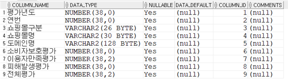
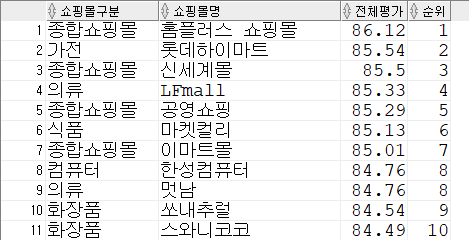
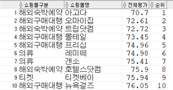
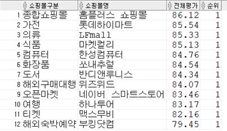
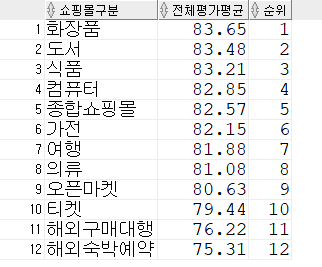
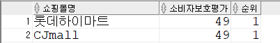

### 1. 주제 : 2019-2020 〈서울시 인터넷 쇼핑몰 100개 평가 정보〉 분석
서울시전자상거래센터는 인터넷 쇼핑몰 간 공정한 경쟁을 유도하고 정보에 기반한 소비자들의 구매를 돕기 위해 2007년부터 ‘인터넷 쇼핑몰 평가’를 진행하고 있다.
평가점수를 기반으로 하여 2019년도와 2020년도의 인터넷 쇼핑몰 시장 추세에 대해서 분석하고 연도별로 차이를 비교한다.

### 2. 데이터 수집
1. 데이터 출처 : https://data.seoul.go.kr/dataList/OA-21171/S/1/datasetView.do#
2. 데이터 정보 : 서울시 인터넷 쇼핑몰 100개 평가 정보.csv
    - 서울시전자상거래센터는 방문자 수가 많았던 100개 쇼핑몰을 상대로 ‘소비자보호평가(50점)’, ‘이용자만족평가(40점)’, ‘피해발생평가(10점)’의 3가지 항목의 평가점수를 합산했다.

    - 소비자보호평가 : 청약 철회 준수 여부, 초기화면 표시 필수항목, 이용약관 준수 정도, 결제 방법, 구매 안전서비스 제공 여부, 개인정보 보호 정책, 회원 탈퇴 방법, 고객 불만 게시판 운영, 청약 철회시 배송비 부담 등 10개 항목에 대해 평가한다.

    - 이용자만족평가 : 최근 1년 내 해당 쇼핑몰 이용 경험이 있는 20~50대 소비자 4,000명(쇼핑몰별 40명)을 대상으로 소비자 서비스, 이용 편의성, 정보 제공, 배송 등 20개 문항에 대한 만족도를 측정하는 방식이다. 

    - 피해발생평가 : 서울시전자상거래센터에 접수된 업체별 소비자 불만 내용을 분석해 5건 이상 접수된 불만 내용에 대한 처리 수준과 처리 기일을 10점 기준으로 점수를 부여한다. 불만이 4건 이하인 업체는 10점을 부여한다.

3. 컬럼정보

<p align = "center"></p>

### 3. 데이터 분석
1. 테이블 생성 : 테이블명 shop100

    - 데이터 수정 : 평가년도 2020년과 2019년도의 쇼핑몰구분 항목 중 ‘해외숙박예약’이 NULL 값으로 들어가 있어서 CSV 파일에서 수정하였다.
    - 서울시 인터넷 쇼핑몰 100개 평가 정보.csv 파일을 데이터 임포트하여 테이블명 ‘shop100’으로 설정하였다.


2. 연도별 데이터 분석(2019-2020)

    **1) 2019년도 〈서울시 인터넷 쇼핑몰 100개 평가 정보〉 분석**
    
    - 2019년도 평가 결과 – 전체평가 순위
    ```
    select 쇼핑몰구분, 쇼핑몰명, 전체평가, dense_rank() over(order by 전체평가 desc) 순위
    from shop100
    where 평가년도 = 2019; -- 전체평가 점수가 높은 순으로 정렬
    ```
    
    <p align = "center"></p>
    
    <div align = "center">①홈플러스 쇼핑몰(86.12점, 종합쇼핑몰), ②롯데하이마트(85.54점, 가전),</br>
    ③신세계몰(85.5점, 종합쇼핑몰)이 종합평가 순위 1, 2, 3위를 차지했다.</div></br>
    
    ```
    select 쇼핑몰구분, 쇼핑몰명, 전체평가, dense_rank() over(order by 전체평가 asc) 순위
    from shop100
    where 평가년도 = 2019; -- 전체평가 점수가 낮은 순으로 정렬
    ```
    
    <p align = "center"></p>
    
    <div align = "center">한편, 전체평가에서 낮은 점수를 받은 쇼핑몰은 주로 ‘해외숙박예약’과 ‘해외구매대행’ 분야에서 나타났다.</div></br>
    
    - 2019년도 평가 결과 – 쇼핑몰구분(12개의 분야)별 1위 업체
    ```
    select *
    from (select 쇼핑몰구분, 쇼핑몰명, 전체평가, dense_rank() over(partition by 쇼핑몰구분 order by 전체평가 desc) 순위
            from shop100
            where 평가년도 = 2019)
    where 순위 = 1
    order by 전체평가 desc;
    ```
    
    <p align = "center"></p>
    
    <div align = "center">12가지의 쇼핑몰구분별 1위 업체는 ①종합쇼핑몰: 홈플러스 쇼핑몰(86.12점), ②가전: 롯데하이마트(85.54점),</br> 
    ③의류: LF몰(85.33점), ④식품: 마켓컬리(85.13점), ⑤컴퓨터: 한성컴퓨터(84.76점), ⑥화장품: 쏘내추럴(84.54점), </br>
    ⑦도서: 반디앤루니스(84.34점), ⑧해외구매대행: 위즈위드(84.07점), ⑨오픈마켓: 네이버 스마트스토어(83.46점), </br>
    ⑩여행: 하나투어(83.17점), ⑪티켓: 맥스무비(82.16점) ⑫해외숙박예약: 부킹닷컴(79.45점)으로 나타났다.</div></br>
    
    - 2019년도 평가 결과 – 쇼핑몰구분별 전체평가 평균점수 순위
    ```
    select 쇼핑몰구분, trunc(avg(전체평가), 2) 전체평가평균, dense_rank() over(order by avg(전체평가) desc) 순위
    from shop100
    where 평가년도 = 2019
    group by 쇼핑몰구분;
    ```
    
    <p align = "center"></p>
    
    <div align = "center">쇼핑몰구분별 전체평가 평균점수는 ‘화장품’이 평균 83.65점으로 가장 높았고, ‘도서’(평균 83.48점)와 ‘식품’(평균 83.21점)이 뒤를 이었다.</br>반면 ‘해외구매대행’(평균 76.22점)과 ‘해외숙박예약’(평균 75.31점)은 낮은 점수를 받아 개선이 필요한 것으로 나타났다.</div></br>
    
    - 2019년도 평가 결과 – 소비자보호평가 순위
    ```
    select 쇼핑몰명, 소비자보호평가, dense_rank() over (order by 소비자보호평가 desc) 순위
    from shop100
    where 평가년도 = 2019; -- 소비자보호평가 점수가 높은 순으로 정렬
    ```
    
    <p align = "center"></p>
    
    <div align = "center">전자상거래관련법 준수여부를 보는 ‘소비자보호평가(50점)’에서 ‘롯데하이마트’와 ‘CJ몰’이 49점으로 가장 높은 점수를 받았다.</
