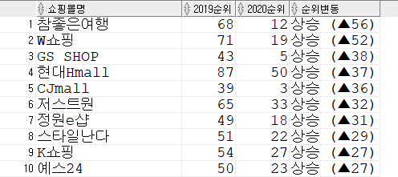

### 1. 주제 : 2019-2020 〈서울시 인터넷 쇼핑몰 100개 평가 정보〉 분석
서울시전자상거래센터는 인터넷 쇼핑몰 간 공정한 경쟁을 유도하고 정보에 기반한 소비자들의 구매를 돕기 위해 2007년부터 ‘인터넷 쇼핑몰 평가’를 진행하고 있다.
평가점수를 기반으로 하여 2019년도와 2020년도의 인터넷 쇼핑몰 시장 추세에 대해서 분석하고 연도별로 차이를 비교한다.

### 2. 데이터 수집
1. 데이터 출처 : https://data.seoul.go.kr/dataList/OA-21171/S/1/datasetView.do#
2. 데이터 정보 : 서울시 인터넷 쇼핑몰 100개 평가 정보.csv
    - 서울시전자상거래센터는 방문자 수가 많았던 100개 쇼핑몰을 상대로 ‘소비자보호평가(50점)’, ‘이용자만족평가(40점)’, ‘피해발생평가(10점)’의 3가지 항목의 평가점수를 합산했다.

    - 소비자보호평가 : 청약 철회 준수 여부, 초기화면 표시 필수항목, 이용약관 준수 정도, 결제 방법, 구매 안전서비스 제공 여부, 개인정보 보호 정책, 회원 탈퇴 방법, 고객 불만 게시판 운영, 청약 철회시 배송비 부담 등 10개 항목에 대해 평가한다.

    - 이용자만족평가 : 최근 1년 내 해당 쇼핑몰 이용 경험이 있는 20~50대 소비자 4,000명(쇼핑몰별 40명)을 대상으로 소비자 서비스, 이용 편의성, 정보 제공, 배송 등 20개 문항에 대한 만족도를 측정하는 방식이다. 

    - 피해발생평가 : 서울시전자상거래센터에 접수된 업체별 소비자 불만 내용을 분석해 5건 이상 접수된 불만 내용에 대한 처리 수준과 처리 기일을 10점 기준으로 점수를 부여한다. 불만이 4건 이하인 업체는 10점을 부여한다.

3. 컬럼정보

<p align = "center"></p>

### 3. 데이터 분석
1. 테이블 생성 : 테이블명 shop100

    - 데이터 수정 : 평가년도 2020년과 2019년도의 쇼핑몰구분 항목 중 ‘해외숙박예약’이 NULL 값으로 들어가 있어서 CSV 파일에서 수정하였다.
    - 서울시 인터넷 쇼핑몰 100개 평가 정보.csv 파일을 데이터 임포트하여 테이블명 ‘shop100’으로 설정하였다.


2. 연도별 데이터 분석(2019-2020)

    **1) 2019년도 〈서울시 인터넷 쇼핑몰 100개 평가 정보〉 분석**
    
    - 2019년도 평가 결과 – 전체평가 순위
    ```
    select 쇼핑몰구분, 쇼핑몰명, 전체평가, dense_rank() over(order by 전체평가 desc) 순위
    from shop100
    where 평가년도 = 2019; -- 전체평가 점수가 높은 순으로 정렬
    ```
    
    <p align = "center"></p>
    
    <div align = "center">①홈플러스 쇼핑몰(86.12점, 종합쇼핑몰), ②롯데하이마트(85.54점, 가전),</br>
    ③신세계몰(85.5점, 종합쇼핑몰)이 종합평가 순위 1, 2, 3위를 차지했다.</div></br>
    
    ```
    select 쇼핑몰구분, 쇼핑몰명, 전체평가, dense_rank() over(order by 전체평가 asc) 순위
    from shop100
    where 평가년도 = 2019; -- 전체평가 점수가 낮은 순으로 정렬
    ```
    
    <p align = "center"></p>
    
    <div align = "center">한편, 전체평가에서 낮은 점수를 받은 쇼핑몰은 주로 ‘해외숙박예약’과 ‘해외구매대행’ 분야에서 나타났다.</div></br>
    
    - 2019년도 평가 결과 – 쇼핑몰구분(12개의 분야)별 1위 업체
    ```
    select *
    from (select 쇼핑몰구분, 쇼핑몰명, 전체평가, dense_rank() over(partition by 쇼핑몰구분 order by 전체평가 desc) 순위
            from shop100
            where 평가년도 = 2019)
    where 순위 = 1
    order by 전체평가 desc;
    ```
    
    <p align = "center"></p>
    
    <div align = "center">12가지의 쇼핑몰구분별 1위 업체는 ①종합쇼핑몰: 홈플러스 쇼핑몰(86.12점), ②가전: 롯데하이마트(85.54점),</br> 
    ③의류: LF몰(85.33점), ④식품: 마켓컬리(85.13점), ⑤컴퓨터: 한성컴퓨터(84.76점), ⑥화장품: 쏘내추럴(84.54점), </br>
    ⑦도서: 반디앤루니스(84.34점), ⑧해외구매대행: 위즈위드(84.07점), ⑨오픈마켓: 네이버 스마트스토어(83.46점), </br>
    ⑩여행: 하나투어(83.17점), ⑪티켓: 맥스무비(82.16점) ⑫해외숙박예약: 부킹닷컴(79.45점)으로 나타났다.</div></br>
    
    - 2019년도 평가 결과 – 쇼핑몰구분별 전체평가 평균점수 순위
    ```
    select 쇼핑몰구분, trunc(avg(전체평가), 2) 전체평가평균, dense_rank() over(order by avg(전체평가) desc) 순위
    from shop100
    where 평가년도 = 2019
    group by 쇼핑몰구분;
    ```
    
    <p align = "center"></p>
    
    <div align = "center">쇼핑몰구분별 전체평가 평균점수는 ‘화장품’이 평균 83.65점으로 가장 높았고, ‘도서’(평균 83.48점)와 ‘식품’(평균 83.21점)이 뒤를 이었다.</br>반면 ‘해외구매대행’(평균 76.22점)과 ‘해외숙박예약’(평균 75.31점)은 낮은 점수를 받아 개선이 필요한 것으로 나타났다.</div></br>
    
    - 2019년도 평가 결과 – 소비자보호평가 순위
    ```
    select 쇼핑몰명, 소비자보호평가, dense_rank() over (order by 소비자보호평가 desc) 순위
    from shop100
    where 평가년도 = 2019; -- 소비자보호평가 점수가 높은 순으로 정렬
    ```
    
    <p align = "center"></p>
    
    <div align = "center">전자상거래관련법 준수여부를 보는 ‘소비자보호평가(50점)’에서</br>
    ‘롯데하이마트’와 ‘CJ몰’이 49점으로 가장 높은 점수를 받았다.</div></br>
    
    ```
    select 쇼핑몰명, 소비자보호평가, dense_rank() over (order by 소비자보호평가 asc) 순위
    from shop100
    where 평가년도 = 2019; -- 소비자보호평가 점수가 낮은 순으로 정렬
    ```
    
    <p align = "center"></p>
    
    <div align = "center">한편, 2019년도부터 신규로 평가대상에 포함된 해외숙박예약 사이트들은 소비자보호평가 점수가 낮은 편이었다. 실제로 평가대상 6곳 중 사업자 정보를 제대로 표기한 곳은 2곳에 불과하고, 사이트 내에서 회원탈퇴가 가능한 곳도 2곳 밖에 없었다.</div></br>
    
    - 2019년도 평가 결과 – 이용자만족평가 순위
    ```
    select 쇼핑몰명, 이용자만족평가, dense_rank() over (order by 이용자만족평가 desc) 순위
    from shop100
    where 평가년도 = 2019;
    ```
    
    <p align = "center"></p>
    
    <div align = "center">이용자만족평가(40점)’ 항목은 교보문고가 28.91점으로 1위를 하였고, 이외에 예스24, 알라딘이 소비자들로부터 높은 평가를 받았다.
    </div></br>
    
    ```
    select 쇼핑몰구분, trunc(avg(이용자만족평가), 2) 이용자만족평가평균, dense_rank() over(order by avg(이용자만족평가) desc) 순위
    from shop100
    where 평가년도 = 2019
    group by 쇼핑몰구분;
    ```
    
    <p align = "center"></p>
    
    <div align = "center">‘이용자만족평가(40점)’ 항목을 쇼핑몰구분별로 평균을 내면 앞서 교보문고와 예스24, 알라딘이 전체 쇼핑몰 중에서 소비자들에게 높은 평가를 받은 것처럼, ‘도서’ 분야가 28.08점으로 평균점수가 가장 높았고, 다음으로는 ‘식품’, ‘종합쇼핑몰’, ‘화장품’ 순이다.</div></br>
    
    - 2019년도 평가 결과 – 피해발생평가 순위
    ```
    select 쇼핑몰명, 피해발생평가, dense_rank() over(order by 피해발생평가 desc) 순위
    from shop100
    where 평가년도 = 2019;
    
    select 피해발생평가, count(*) 해당쇼핑몰수
    from shop100
    where 평가년도 = 2019
    group by 피해발생평가;
    ```
    
    <p align = "center"></p>
    
    <div align = "center">소비자불만에 대한 처리수준과 처리기일 등을 평가하는 ‘피해발생평가(10점)’에 대한 점수는</br>
    100개 업체 중 92개가 10점 만점을 받아 소비자 불만 발생 시 적절하게 대응하는 것으로 나타났다.</div></br>
    
    
    **- 2019년도 서울시 인터넷 쇼핑몰 100개 평가 정보 종합 분석**
    - 2019년 평가 결과 종합쇼핑몰인 ‘홈플러스 쇼핑몰’이 100점 만점에 86.12점으로 1위로 평가되었고, ‘롯데하이마트’와 ‘신세계몰’이 뒤를 이었다. 
    - 2019년도 서울시 인터넷 쇼핑몰 100개 평가에서 쇼핑몰구분 중 ‘화장품’이 가장 만족도가 높았고, ‘도서’와 ‘식품’이 다음이었다. 반면 ‘해외숙박예약’과 ‘해외구매대행’분야는 낮은 점수를 받아 개선이 필요한 것으로 나타났다. 
    - 2019년도부터 신규로 평가대상에 포함된 해외숙박예약 사이트들은 소비자보호평가 점수가 낮은 편이다. 서울시 전자상거래센터에서 소비자들이 자주 이용하는 해외숙박예약 사이트 경험자를 상대로 실시한 설문조사에 따르면 피해 경험률이 매년 증가하고 있는 것으로 나타났다. 해외숙박예약 사이트 이용 시 불만 내용으로는 ‘정당한 계약 해지 및 환불거절’이 가장 높게 나타났으며, ‘허위 및 과장광고’, ‘계약조건 불이행 및 계약변경’이 뒤를 이었다.</br>

    
    **2) 2020년도 〈서울시 인터넷 쇼핑몰 100개 평가 정보〉 분석**
    
    - 2020년도 평가 결과 – 전체평가 순위
    ```
    select 쇼핑몰구분, 쇼핑몰명, 전체평가, dense_rank() over(order by 전체평가 desc) 순위
    from shop100
    where 평가년도 = 2020; -- 전체평가 점수가 높은 순으로 정렬
    ```
    
    <p align = "center"></p>

    <div align = "center">①마켓컬리(86.76점, 식품), ②홈플러스(86.38점, 종합쇼핑몰), ③CJ몰(86.3점, 종합쇼핑몰)이 종합평가 순위 1, 2, 3위를 차지했다.</div>
    </br>
    
    ```
    select 쇼핑몰구분, 쇼핑몰명, 전체평가, dense_rank() over(order by 전체평가 asc) 순위
    from shop100
    where 평가년도 = 2020; -- 전체평가 점수가 낮은 순으로 정렬
    ```
    
    <p align = "center"></p>
    
    <div align = "center">한편, 전체평가에서 낮은 점수를 받은 쇼핑몰은 주로 ‘해외숙박예약’과 ‘해외구매대행’ 분야에서 나타났다.</div></br>
    
    - 2020년도 평가 결과 – 쇼핑몰구분(12개의 분야)별 1위 업체
    ```
    select *
    from (select 쇼핑몰구분, 쇼핑몰명, 전체평가, dense_rank() over(partition by 쇼핑몰구분 order by 전체평가 desc) 순위
            from shop100
            where 평가년도 = 2020)
    where 순위 = 1
    order by 전체평가 desc;
    ```
    
    <p align = "center"></p>
    
    <div align = "center">12가지의 쇼핑몰구분별 1위 업체는 ①식품: 마켓컬리(86.76점), ②종합쇼핑몰: 홈플러스(86.38점),</br>
    ③화장품: 아모레퍼시픽몰(85.42점), ④의류: 젝시믹스(85.18점), ⑤여행: 참좋은여행(85.08점), ⑥도서: 예스24(84.43점),</br>
    ⑦가전: 하이마트(84.32점), ⑧오픈마켓: 네이버 스마트스토어(84.31점), ⑨컴퓨터: 컴퓨존(83.33점),</br>
    ⑩해외구매대행: 위즈위드(81.88점), ⑪티켓: 티켓링크(80.88점), ⑫해외숙박예약: 부킹닷컴(80.17점)으로 나타났다.</div></br>
    
    - 2020년도 평가 결과 – 쇼핑몰구분별 전체평가 평균점수 순위
    ```
    select 쇼핑몰구분, trunc(avg(전체평가), 2) 전체평가평균, dense_rank() over(order by avg(전체평가) desc) 순위
    from shop100
    where 평가년도 = 2020
    group by 쇼핑몰구분;
    ```
    
    <p align = "center"></p>
    
    <div align = "center">쇼핑몰구분별 전체평가 평균점수는 ‘식품’이 평균 85.2점으로 가장 높았고, ‘화장품’(평균 83.56점), ‘도서’(평균 83.47점)가 뒤를 이었다. 반면 ‘해외구매대행’(평균 75.12점)과 ‘해외숙박예약’(평균 75.17점)은 낮은 점수를 받아 지속적인 관리가 필요할 것으로 보인다.
    </br></br>
    ‘식품’이 소비자들에게 평균적으로 높은 점수를 받은 것은 1인 가구 증가와 코로나19 장기화로 온라인 주문이 급상승했고, 이에 대응하기 위해 업체들이 당일배송 및 예약배송 시스템을 갖춰 소비자들의 편의를 높인 점이 반영된 것으로 분석된다.</div></br>
    
    - 2020년도 평가 결과 – 소비자보호평가 순위
    ```
    select 쇼핑몰명, 소비자보호평가, dense_rank() over (order by 소비자보호평가 desc) 순위
    from shop100
    where 평가년도 = 2020; -- 소비자보호평가 점수가 높은 순으로 정렬
    ```
    
    <p align = "center"></p>
    
    <div align = "center">전자상거래관련법 준수여부를 보는 ‘소비자보호평가(50점)’ 항목에서는 반품 시에도 배송비를 사업자가 부담하는 코스트코(COSTCO)가 49점으로 가장 높은 점수를 받았다.</div></br>
    
    ```
   select 쇼핑몰명, 소비자보호평가, dense_rank() over (order by 소비자보호평가 asc) 순위
    from shop100
    where 평가년도 = 2020; -- 소비자보호평가 점수가 낮은 순으로 정렬 
    ```
    
    <p align = "center"></p>
    
    <div align = "center">반면 아고다와 트립닷컴은 국내 사업장 주소지, 연락처, 이메일 등의 사업자 정보를 온라인 쇼핑몰 메인화면에 표시하지 않고, 표준약관 미준수 등의 이유로 소비자 보호 평가점수가 38점으로 가장 낮았다.</div></br>
    
    - 2020년도 평가 결과 – 이용자만족평가 순위
    ```
    select 쇼핑몰명, 이용자만족평가, dense_rank() over (order by 이용자만족평가 desc) 순위
    from shop100
    where 평가년도 = 2020;
    ```
    
    <p align = "center"></p>
    
    <div align = "center">‘이용자만족평가(40점)’ 항목은 전체평가 점수가 가장 높았던 마켓컬리(30.76점)가 1위를 하였고,</br>
    이외에 교보문고, 예스24, 신세계몰 등이 소비자들로부터 높은 평가를 받았다.</div></br>
    
    ```
    select 쇼핑몰구분, trunc(avg(이용자만족평가), 2) 이용자만족평가평균, dense_rank() over(order by avg(이용자만족평가) desc) 순위
    from shop100
    where 평가년도 = 2020
    group by 쇼핑몰구분;
    ```
    
    <p align = "center"></p>
    
    <div align = "center">‘이용자만족평가(40점)’ 항목을 쇼핑몰구분별로 평균을 내면 ‘식품’과 ‘도서’, ‘종합쇼핑몰’이 높은 순위를 보이는데, 이러한 쇼핑몰 분야들은 배송 서비스에 특징을 두고 있다. 배송 서비스가 소비자들의 온라인 쇼핑몰 선택시 중요 기준이 된다는 것을 알 수 있다.</div></br>
    
    - 2020년도 평가 결과 – 피해발생평가 순위
    ```
    select 쇼핑몰명, 피해발생평가, dense_rank() over(order by 피해발생평가 desc) 순위
    from shop100
    where 평가년도 = 2020;
    
    select 피해발생평가, count(*) 해당쇼핑몰수
    from shop100
    where 평가년도 = 2020
    group by 피해발생평가;
    ```
    
    <p align = "center"></p>
    
    <div align = "center">소비자불만에 대한 처리수준과 처리기일 등을 평가하는 ‘피해발생평가(10점)’에 대한 점수는</br> 
    100개 업체 중 92개가 10점 만점을 받아 소비자 불만 발생 시 적절하게 대응하는 것으로 나타났다.</div></br>
    
    - **2020년도 서울시 인터넷 쇼핑몰 100개 평가 정보 종합 분석**
    
    - 2020년도 서울시 인터넷 쇼핑몰 100개 평가에서 쇼핑몰구분 중 ‘식품’이 가장 만족도가 높았고, ‘해외숙박예약’과 ‘해외구매대행’분야는 대체로 낮은 점수를 받아 개선이 필요한 것으로 나타났다. 
    - 2020년 전체평가에서 1위를 차지한 쇼핑몰은 ‘마켓컬리’로 새벽배송 시장을 이끄는 대표기업이다. 마켓컬리는 주7일 새벽배송, 풀콜드체인 배송 시스템을 선보였고, 코로나19로 인해 온라인으로 식료품을 사는 수요를 통해 견고한 확장을 이어나가고 있다. 또한, 2021년부터 서울과 수도권 중심으로 진행한 새벽 배송을 확장하여 충청권으로 서비스 지역을 넓혔고, 지난 7월엔 대구에서도 시작하며 전국으로 확장을 추진 중이라는 점을 보아 2021년에도 높은 평가를 유지할 것으로 기대할 수 있다.
    - 2019년도와 동일하게 2020년 소비자보호평가에서 가장 낮은 점수를 받은 쇼핑몰은 ‘아고다’와 ‘트립닷컴’이다. 해외숙박예약업체의 경우 코로나19가 발생한 이후에도 환불정책을 그대로 유지하다가 소비자들의 불만이 늘어나자 해외 입국이 금지된 국가에 대해서만 100% 환불 정책을 시행하여 여론의 뭇매를 맞았다. 또한, 우리나라 정부가 사회적 거리두기 단계를 강화해 숙박 예약을 취소하더라도 업체에서는 글로벌 정책을 이유로 100% 환불이 어려운 상황이다. 결국, 이러한 해외숙박예약업체가 국내 숙박 예약고객들의 만족도를 끌어올리기 위해서는 국내 소비환경에 발맞춘 유연한 현지화 정책을 마련해야 할 것으로 보인다.</br></br>

    **3) 〈서울시 인터넷 쇼핑몰 100개 평가 정보〉 - 2019년도와 2020년도 비교**
    
    - 2019년도와 2020년도 모두 평가된 쇼핑몰 목록
    ```
    select case when 쇼핑몰명 like '갤러리아%' then '갤러리아몰'
                when 쇼핑몰명 like '더블유%' then 'W쇼핑'
                when 쇼핑몰명 like '아모레퍼시픽%' then '아모레퍼시픽몰'
                when 쇼핑몰명 like '%하이마트' then '하이마트'
                when 쇼핑몰명 like '홈플러스%' then '홈플러스'
                when 쇼핑몰명 like '롯데닷컴%' then '롯데온'
                when 쇼핑몰명 like '전자랜드%' then '전자랜드'
                else 쇼핑몰명 end as 쇼핑몰명
    from shop100
    where 평가년도 = 2019
    intersect
    select case when 쇼핑몰명 like 'CJ mall' then 'CJmall'
                when 쇼핑몰명 like '%라걸' then '라걸'
                when 쇼핑몰명 like '%아싸컴%' then '아싸컴'
                else 쇼핑몰명 end as 쇼핑몰명
    from shop100
    where 평가년도 = 2020
    order by 쇼핑몰명;
    ```
    
    <div align = "center">총 83개</br>
    도메인명은 같지만 쇼핑몰명이 다르게 표시된 것, 영문이 한글로 표시된 것,</br>
    공백 포함으로 인해 검색이 안 되는 데이터들이 검색되도록 변경해주었다.</div></br>
    
    - 2019년도와 2020년도 모두 평가된 쇼핑몰의 전체평가 등수 및 순위변동
    ```
    select a.쇼핑몰명, a.순위 as "2019순위", b.순위 as "2020순위", 
           case when (a.순위 - b.순위) > 0 then '상승 ' || '(▲' ||(a.순위 - b.순위) || ')'
                 when (a.순위 - b.순위) < 0 then '하락 ' || '(▼' || ABS(a.순위 - b.순위) || ')'
                 else '유지 (-)' end as 순위변동
    from (select case when 쇼핑몰명 like '갤러리아%' then '갤러리아몰'
                    when 쇼핑몰명 like '더블유%' then 'W쇼핑'
                    when 쇼핑몰명 like '아모레퍼시픽%' then '아모레퍼시픽몰'
                    when 쇼핑몰명 like '%하이마트' then '하이마트'
                    when 쇼핑몰명 like '홈플러스%' then '홈플러스'
                    when 쇼핑몰명 like '롯데닷컴%' then '롯데온'
                    when 쇼핑몰명 like '전자랜드%' then '전자랜드'
                    else 쇼핑몰명 end as 쇼핑몰명, rank() over(order by 전체평가 desc) 순위
        from shop100
        where 평가년도 = 2019) a
        join (select case when 쇼핑몰명 like 'CJ mall' then 'CJmall'
                    when 쇼핑몰명 like '%라걸' then '라걸'
                    when 쇼핑몰명 like '%아싸컴%' then '아싸컴'
                    else 쇼핑몰명 end as 쇼핑몰명, rank() over(order by 전체평가 desc) 순위
        from shop100
        where 평가년도 = 2020) b
        on a.쇼핑몰명 = b.쇼핑몰명
    order by 2;
    ```
    
    <p align = "center"></p>
    
    - 2019년도와 2020년도 모두 평가된 쇼핑몰 중 순위가 가장 많이 상승한 쇼핑몰
    ```
    select a.쇼핑몰명, a.순위 as "2019순위", b.순위 as "2020순위", 
           case when (a.순위 - b.순위) > 0 then '상승 ' || '(▲' ||(a.순위 - b.순위) || ')'
                 when (a.순위 - b.순위) < 0 then '하락 ' || '(▼' || ABS(a.순위 - b.순위) || ')'
                 else '유지 (-)' end as 순위변동
    from (select case when 쇼핑몰명 like '갤러리아%' then '갤러리아몰'
                    when 쇼핑몰명 like '더블유%' then 'W쇼핑'
                    when 쇼핑몰명 like '아모레퍼시픽%' then '아모레퍼시픽몰'
                    when 쇼핑몰명 like '%하이마트' then '하이마트'
                    when 쇼핑몰명 like '홈플러스%' then '홈플러스'
                    when 쇼핑몰명 like '롯데닷컴%' then '롯데온'
                    when 쇼핑몰명 like '전자랜드%' then '전자랜드'
                    else 쇼핑몰명 end as 쇼핑몰명, rank() over(order by 전체평가 desc) 순위
        from shop100
        where 평가년도 = 2019) a
        join (select case when 쇼핑몰명 like 'CJ mall' then 'CJmall'
                    when 쇼핑몰명 like '%라걸' then '라걸'
                    when 쇼핑몰명 like '%아싸컴%' then '아싸컴'
                    else 쇼핑몰명 end as 쇼핑몰명, rank() over(order by 전체평가 desc) 순위
        from shop100
        where 평가년도 = 2020) b
        on a.쇼핑몰명 = b.쇼핑몰명
    where (a.순위 - b.순위) > 0
    order by (a.순위 - b.순위) desc;
    ```
    
    <p align = "center"></p>
    
    - 2019년도와 2020년도 모두 평가된 쇼핑몰 중 순위가 가장 많이 하락한 쇼핑몰
    ```
    select a.쇼핑몰명, a.순위 as "2019순위", b.순위 as "2020순위", 
           case when (a.순위 - b.순위) > 0 then '상승 ' || '(▲' ||(a.순위 - b.순위) || ')'
                 when (a.순위 - b.순위) < 0 then '하락 ' || '(▼' || ABS(a.순위 - b.순위) || ')'
                 else '유지 (-)' end as 순위변동
    from (select case when 쇼핑몰명 like '갤러리아%' then '갤러리아몰'
                    when 쇼핑몰명 like '더블유%' then 'W쇼핑'
                    when 쇼핑몰명 like '아모레퍼시픽%' then '아모레퍼시픽몰'
                    when 쇼핑몰명 like '%하이마트' then '하이마트'
                    when 쇼핑몰명 like '홈플러스%' then '홈플러스'
                    when 쇼핑몰명 like '롯데닷컴%' then '롯데온'
                    when 쇼핑몰명 like '전자랜드%' then '전자랜드'
                    else 쇼핑몰명 end as 쇼핑몰명, rank() over(order by 전체평가 desc) 순위
        from shop100
        where 평가년도 = 2019) a
        join (select case when 쇼핑몰명 like 'CJ mall' then 'CJmall'
                    when 쇼핑몰명 like '%라걸' then '라걸'
                    when 쇼핑몰명 like '%아싸컴%' then '아싸컴'
                    else 쇼핑몰명 end as 쇼핑몰명, rank() over(order by 전체평가 desc) 순위
        from shop100
        where 평가년도 = 2020) b
        on a.쇼핑몰명 = b.쇼핑몰명
    where (a.순위 - b.순위) < 0
    order by ABS(a.순위 - b.순위) desc;
    ```
    
    <p align = "center"></p></br>
    
    - **〈서울시 인터넷 쇼핑몰 100개 평가 정보〉 - 2019년도와 2020년도 비교 종합 분석**
        - 〈서울시 인터넷 쇼핑몰 100개 평가 정보〉에서 평가년도 2019년도와 2020년도 모두 평가대상이 된 쇼핑몰 목록은 총 83개이다. 그중 가장 순위가 많이 상승한 쇼핑몰은 ‘참좋은여행(68위 → 12위)’이고, 그 외에 ‘GS SHOP’, ‘CJmall’, ‘동원몰’, ‘롯데i몰(롯데홈쇼핑)’, ‘아모레퍼시픽몰’은 2019년도에 10위권 밖이었지만 2020년도에 10위권 안으로 순위가 상승하여 좋은 평가를 받았다. 
        - 가장 순위가 많이 하락한 쇼핑몰은 ‘홈앤쇼핑(26위 → 90위)’이고, 2019년 기준 10위권 안에 들었던 ‘한성컴퓨터’, ‘공영쇼핑’, ‘하이마트’, ‘쏘내추럴’은 2020년도에는 10위권 밖의 순위로 하락하였다. 
    
